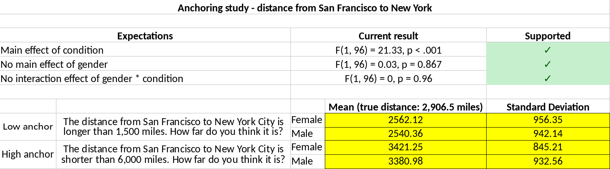
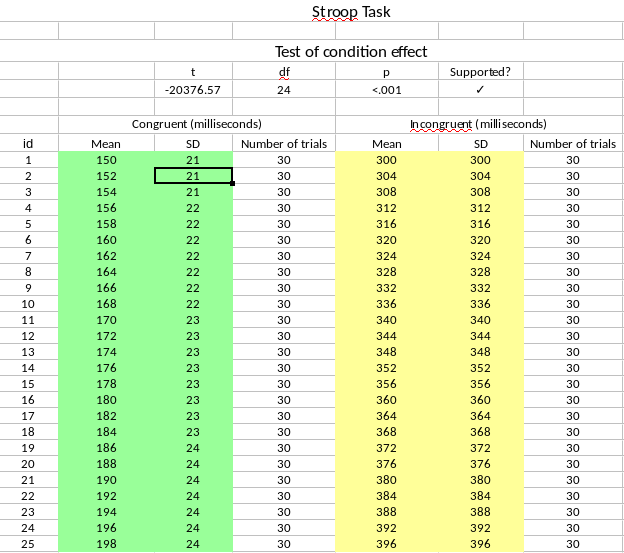

```{r echo = FALSE}
# also requires dplyr
library(ggplot2)
library(plyr)
library(viridis)
library(magrittr)
# devtools::install_github('chartgerink/ddfab')
# library(ddfab)

options(digits = 3)

source('../functions/digit_analysis.R')
source('../functions/std_var.R')
source('../functions/fisher_method.R')

file <- '../data/study_01/raw_summary_results_fabrication_qualtrics.csv'
res_file <- '../data/study_01/qualtrics_processed.csv'
ml_dat_file <- '../data/study_01/anchoring_ml/chjh ml1_anchoring cleaned.sav'
summary_stat_file <- '../data/study_01/ml_summary_stats.csv'
ml3_dat_file <- '../data/study_02/study_02-ml3_stroop/StroopCleanSet.csv'
pdf_file <- '../archive/gender_interaction.pdf'

# Set the number of iterations to use in calculations
iter <- 100000

tabnr <- 1
fignr <- 1
```

<!-- 10.1016/j.jclinepi.2017.03.018 -->

# Introduction

```{r echo = FALSE}
m <- 50
sd <- 10
n <- 100

set.seed(1234)
x1_1 <- replicate(n = 10, expr = rnorm(n, m, sd))
x1_2 <- replicate(n = 10, expr = rnorm(n, m, sd))

ex1_1em <- apply(x1_1, 2, mean)
ex1_1esd <- apply(x1_1, 2, sd)
ex1_1cm <- apply(x1_2, 2, mean)
ex1_1csd <- apply(x1_2, 2, sd)
ex1_1tp <- NULL
for (i in 1:dim(x1_1)[2]) ex1_1tp[i] <- t.test(x = x1_1[,i], y = x1_2[,i], var.equal=TRUE)$p.value
ex1_1tp <- unlist(ex1_1tp)

set.seed(1234)
x2_1em <- replicate(n = 10, expr = m + runif(1, 0, 20))
x2_2cm <- replicate(n = 10, expr = m + runif(1, 0, 20))
x2_1esd <- replicate(n = 10, expr = sd + runif(1, 0, 1.5))
x2_2csd <- replicate(n = 10, expr = sd + runif(1, 0, 1.5))

sdpooled <- ((n - 1) * x2_1esd^2 + (n - 1) * x2_2csd^2)/(n * 2 - 2)
tval <- (x2_1em - x2_2cm) / sdpooled
ex2_1tp <- pt(abs(tval), n * 2 - 2, lower.tail = FALSE) * 2

# Just saving for later use in theory section
# set.seed(1234)
# std_var(n = rep(100, length(x2_1esd) * 2), sds = c(x2_1esd, x2_2csd), iter = 10000)

df <- data.frame(study = sprintf("Study %s", 1:10),
         sprintf("%s (%s)", round(ex1_1em, 3), round(ex1_1esd, 3)),
         sprintf("%s (%s)", round(ex1_1cm, 3), round(ex1_1csd, 3)),
         ex1_1tp,
         sprintf("%s (%s)", round(x2_1em, 3), round(x2_1esd, 3)),
         sprintf("%s (%s)", round(x2_2cm, 3), round(x2_2csd, 3)),
         ex2_1tp)
names(df) <- c("Study",
        "$M_E$ ($SD_E$) [S1]",
        "$M_C$ ($SD_C$) [S1]",
        "P-value [S1]",
        "$M_E$ ($SD_E$) [S2]",
        "$M_C$ ($SD_C$) [S2]",
        "P-value [S2]")
```

Any field of empirical inquiry is faced with cases of scientific misconduct at some point, either in the form of fabrication, falsification or plagiarism (FFP). 
Psychology faced Stapel; medical sciences faced Poldermans and Macchiarini; life sciences faced Voignet; physical sciences faced Sch&ouml;n --- these are just a few examples of research misconduct cases in the last decade. 
Overall, an estimated 2\% of all scholars admit to falsifying or fabricating research results at least once [@doi:10.1371/journal.pone.0005738], which due to its self-report nature is likely to be an underestimate. 
The detection rate of data fabrication is likely to be even lower; for example, only around a dozen cases become public in the United States and the Netherlands, despite that there are several hundreds of thousands of researchers in these countries. 
At best, this suggests a detection rate below 1\% of those 2\% who admit to fabricating data --- the tip of a seemingly much larger iceberg.

In order to stifle attempts at data fabrication, improved detection of fabricated data is considered to deter such behavior. 
This idea is based on deterrence theory [@leviathan], which stipulates that increased risk of detection decreases the expected utility of scientific misconduct, hence, fewer people will engage in it. 
Detection techniques have developed to varying degrees for fabrication, falsification, and plagiarism.
Plagiarism scanners have been around the longest [e.g., @doi:10.1109/13.28038] and are widely implemented not only at journals but also in the evaluation of student theses (e.g., with commercial services such as Turnitin). 
For data fabrication, developments around detecting image manipulation are more recent, with some tools even being implemented at journals. 
For example, the Journal of Cell Biology and the EMBO journal scan each submitted image for potential manipulation [@The_Journal_of_Cell_Biology2015-vh;@doi:10.1038/546575a], which supposedly increases the risk of detecting (blatant) image manipulation. 
More recently, algorithms are being developed to automate the scanning of images for such manipulations [@doi:10.1007/s11948-016-9841-7]. 
Moreover, the application of such tools can also help researchers systematically evaluate research articles in order to estimate the extent to which image manipulation occurs [4\% of all papers are estimated to contain manipulated images, @doi:10.1128/mBio.00809-16] or what factors are predictive of image manipulation [@doi:10.1007/s11948-018-0023-7]. 

Detection methods for data fabrication in empirical research are often based on a mix of psychology theory and statistics theory. 
Because humans are notoriously bad at understanding and estimating randomness [@Haldane1948-nm;@doi:10.1126/science.185.4157.1124;@doi:10.1037/h0031322;@doi:10.1037/1082-989X.5.2.241], this could manifest itself in the fundamentally probabilistic data they try to fabricate. 
Whether the data and outcomes of analyses based on these data are in line with the (at least partly probabilistic) processes that are assumed to underlie them, may indicate deviations from the reported protocol, potentially even data fabrication. 
<!-- ref naar wagenaar 1972? in l21 -->

Statistical methods have proven to be of importance in initiating data fabrication investigations or in assessing scope of potential data fabrication. 
For example, Kranke, Apfel, and Roewer skeptically perceived Fuji's "incredibly nice" data [@doi:10.1213/00000539-200004000-00053] and used statistical methods to contextualize their skepticism.
At the time, a reviewer perceived them to be on a "crusade  against Fujii and his colleagues" [@doi:10.1111/j.1365-2044.2012.07318.x] and further investigation was absent. 
Only when Carlisle extended the systematic investigation to 168 of Fuji's papers [@doi:10.1111/j.1365-2044.2012.07128.x;@doi:10.1111/anae.13650;@doi:10.1111/anae.13126] did events cumulate into an investigation- and ultimately retraction of 183 of Fuji's peer-reviewed papers [@oransky2015;@doi:10.1016/j.ijoa.2012.10.001]. 
In another example, the Stapel case, statistical evaluation of his oeuvre  occurred after he had already confessed to fabricating data, which resulted in 58 retractions of papers (co-)authored by Stapel [@Levelt2012;@oransky2015].

In order to determine whether the application of statistical methods to detect data fabrication is responsible, their diagnostic value requires further investigation to inform decisions about the utility of these methods. 
Specifically, many of the developed statistical methods to detect data fabrication are quantifications of case specific suspicions by researchers.
Hence, these could be considered mere proposals and their diagnostic value (i.e., sensitivity and specificity) unknown until they are thoroughly validated outside of those specific cases. 
Side-by-side comparisons of these proposed statistical methods is also difficult through the in-casu origin of these methods.
Moreover, the efficacy of these methods based on known cases is likely to be biased, considering that the unknown amount of undetected cases are not included. 
With respect to the utility of these statistical methods, questions about whether the sensitivity and specificity are permissible in light of the severe professional- and personal consequences of potential research misconduct need to be asked [regretfully, the STAP case brings this to the fore very clearly; @doi:10.1038/520600a].
These methods might have utility in misconduct investigations, but not in large-scale applications to screen the literature, depending on the diagnostic values resulting from a controlled investigation.

<!-- Carlisle tested whether Fuji's Randomized Clinical Trials (RCTs) baseline measurements were identically distributed across groups. 
If random assignment occurred, this should be the case. 
As such, the $p$-values for group comparisons would be expected to be uniformly distributed because the null hypothesis of identical distributions across groups is true by definition of the randomized design. 
In the Fuji papers, group comparisons showed excessive consistency, resulting primarily in high $p$-values (e.g., .99, .95) and a high mean $p$-value across the comparisons (mean $p$-value of .5 is expected under uniform distribution).
As an illustration, see Table 1, which depicts 10 hypothetical studies containing 100 participants per condition. 
Set 1 depicts true randomized designs; Set 2 depicts fabricated designs. 
The mean $p$-value for the true randomized design Set 1 is `r round(mean(ex1_1tp), 3)`, whereas the fabricated Set 2 has mean $p$-value `r round(mean(ex2_1tp), 3)`.
 -->
 
<!-- insert code for the r bits in the next paragraph here -->
In this article, we investigate the diagnostic performance of statistical methods to detect data fabrication. 
These statistical methods (outlined below) have not previously been validated using both genuine- and fabricated data.
To that end, we present two studies where we try to distinguish assumably genuine- from known fabricated data.
These studies investigate methods to detect data fabrication in summary statistics (Study 1) or in raw data (Study 2). 
In Study 1, we invited researchers to fabricate summary statistics for a set of four anchoring studies, for which we also had genuine data from the Many Labs 1 initiative [[https://osf.io/pqf9r](https://osf.io/pqf9r); @doi:10.1027/1864-9335/a000178].
In Study 2, we invited researchers to fabricate raw data for a Stroop experiment, for which we also had genuine data from the Many Labs 3 initiative [[https://osf.io/n8xa7/](https://osf.io/n8xa7/); @doi:10.1016/j.jesp.2015.10.012]. 
Before presenting these studies, we expand on the theoretical framework of the investigated statistical methods to detect data fabrication.
<!-- We note that the reviewed methods are not exhaustive of all methods available to test for potential data fabrication in empirical data [see also, @buyse1999;@doi:10.7287/peerj.preprints.2400v1;@doi:10.7287/peerj.preprints.2064v1;@sprite-heathers]. -->

# Theoretical framework

In the current paper, we differentiate between statistical methods to detect potential data fabrication based on reported summary statistics or raw data. 
Below, we expand on the theoretical underpininings of these methods and provide sample code to apply these methods. 
<!-- worth thinking about whether this is ethical if methods prove irresponsible -->
For summary statistics, we review $p$-value analysis, variance analysis, and effect size analysis as potential ways to detect data fabrication. 
$P$-value analyses can be applied whenever a set of nonsignificant $p$-values are reported; variance analysis can be applied whenever a set of variances and accompanying sample sizes are reported for independent, randomly assigned groups; effect size analysis can be used whenever the effect size is reported or can be computed [e.g., an APA reported t- or F-statistic; @doi:10.1525/collabra.71]. 
For raw data, we review digit analyses (i.e., the Newcomb-Benford law and terminal digit analysis) and multivariate associations as potential ways to detect data fabrication. 
The Newcomb-Benford law can be applied on ratio- or count scale measures that have sufficient digits and that are not truncated [@doi:10.1016/j.spa.2005.05.003]; terminal digit analysis can be applied whenever measures have sufficient digits [see also @doi:10.1080/08989629508573866]. 
Multivariate associations can be investigated whenever there are two or more numerical variables available and data on that same relation is available from (assumably) genuine data sources.

## Detecting data fabrication in summary statistics

### P-value analysis

The distribution of a single or a set of independent $p$-values is uniform if the null hypothesis is true; it is right-skewed if the alternative hypothesis is true [@fisher1925]. 
If the model assumptions of the underlying process hold, the distribution of one $p$-value is the result of the population effect size, the precision of the estimate, and the observed effect size, whose properties carry over to a set of $p$-values if those $p$-values are independent.

When assumptions underlying the model used to compute a $p$-value are violated, $p$-value distributions can take on a variety of shapes. 
For example, when optional stopping occurs and the null hypothesis is true, $p$-values just below .05 become more frequent [@doi:10.1080/17470218.2014.982664;@doi:10.7717/peerj.1935]. 
However, when optional stopping occurs under the alternative hypothesis or when other researcher degrees of freedom are used, a right-skewed distribution for significant $p$-values can still occur [@doi:10.1037/xge0000086;@doi:10.7717/peerj.1935].

When independent $p$-values are not right-skewed or uniformly distributed (as would be theoretically expected), it can indicate potential data fabrication. 
For example, in the Fuji case, data of supposedly randomly assigned groups were fabricated. 
In truly randomly assigned groups, the measurements of different groups (prior to an intervention) can be assumed to be generated by the same probabilistic process, resulting in uniformly distributed $p$-values when comparing these groups using statistical tests. 
However, in the Fuji case Carlisle observed many large $p$-values, which ultimately led to the identification of potential data fabrication [@doi:10.1111/j.1365-2044.2012.07128.x]. 
The cause of these large $p$-values is that Fuji, when fabricating the data,  underappreciated the effect of randomness, thereby creating groups of data that were too similar conditional on the null hypothesis of no differences between the groups.
In Table `r tabnr` we illustrate the difference between expected data under the null distribution (Set 1) and excessively consistent and potentially fabricated data (Set 2). 
More specifically, the expected value of a uniform $p$-value distribution is .5, but the fabricated data from our illustration have a mean $p$-value of `r round(mean(ex2_1tp), 3)`.

```{r table_excess, echo = FALSE}
knitr::kable(df, digits = 3, caption = "Examples of means and standard deviations for a continuous outcome in genuine- and fabricated randomized clinical trials. Set 1 (S1) is randomly generated data under the null hypothesis of random assignment (assumed to be the genuine process), whereas Set 2 (S2) is generated under excessive consistency with equal groups. Each trial condition contains 100 participants. The $p$-values are the result of independent $t$-tests comparing the experimental and control conditions within each respective set.")
```

In order to test whether a distribution of independent $p$-values might be fabricated, we previously proposed using the Fisher method [@fisher1925;@doi:10.1186/s41073-016-0012-9]. 
The Fisher method originally was intended as a meta-analytic tool, which tests whether there is sufficient evidence for an effect (i.e., right-skewed $p$-value distribution). 
This test is computed as
$$
\chi^2_{2k}=-2\sum\limits^k_{i=1}\ln(p_i)
$$
where it tests for more smaller $p$-values than larger $p$-values across the $k$ number of $p$-values. 
Reversing this results in
$$
\chi^2_{2k}=-2\sum\limits^k_{i=1}\ln(1-\frac{p_i-t}{1-t})
$$
where it now tests for more larger $p$-values than smaller $p$-values across the $k$ number of $p$-values that fall above the threshold $t$ (i.e., the Fisher method now tests for left-skew). 
When $t=0$, all $p$-values are selected. 
When $t>0$ the remaining $p$-values are rescaled to fit the original 0-1 range (i.e., dividing by $1-t$). 
This test is similar (but not equivalent) to Carlisle's method testing for excessive homogeneity across baseline measurements in RCTs [@doi:10.1111/anae.13938;@doi:10.1111/j.1365-2044.2012.07128.x;@doi:10.1111/anae.13126].

```{r, echo = FALSE}
threshold <- .05
genuine_p <- ex1_1tp[ex1_1tp > threshold]
fab_p <- ex2_1tp[ex2_1tp > threshold]
genuine_chi <- -2 * sum(log(1 - ((genuine_p - threshold) / (1 - threshold))))
fab_chi <- -2 * sum(log(1 - ((fab_p - threshold) / (1 - threshold))))
genuine_chi_p <- pchisq(q = genuine_chi, df = 2 * length(genuine_p), lower.tail = FALSE)
fab_chi_p <- pchisq(q = fab_chi, df = 2 * length(fab_p), lower.tail = FALSE)
x <- c(.21, -.08, -.37, -.08, .32)
pval <- pnorm(abs(x), 0, 1, lower.tail = FALSE) * 2
pval <- pval[pval > threshold]
chi <- -2 * sum(log(1 - ((pval - threshold) / (1 - threshold))))
p_chi <- pchisq(q = chi, df = 2 * length(pval), lower.tail = FALSE)
```

As an example, we apply the reversed Fisher method to both the genuine- and fabricated results. 
Using the threshold $t=`r threshold`$ to only select the nonsignificant results from Table `r tabnr`, we retain $k=`r length(genuine_p)`$ genuine $p$-values and $k=`r length(fab_p)`$ fabricated $p$-values. This results in $\chi^2_{2\times`r length(genuine_p)`}=`r round(genuine_chi, 3)`,p=`r round(genuine_chi_p, 3)`$ for the genuine data from Table xxxx, and $\chi^2_{2\times`r length(fab_p)`}=`r round(fab_chi, 3)`,p=`r round(fab_chi_p, 7)`$ for the fabricated data from Table `r tabnr`. 
Another more practical example directly from the Fuji case [@doi:10.1111/j.1365-2044.2012.07128.x], anecdotally illustrates that actual fabricated data can result in significant findings with the reversed Fisher method. 
For example, $p$-values extracted from the original Table 3 [fentanyl dose; @doi:10.1111/j.1365-2044.2012.07128.x] for five independent comparisons also show excessively high $p$-values, $\chi^2_{2\times`r length(pval)`}=`r round(chi, 3)`, p=`r round(p_chi, 3)`$.
However, based on this anecdotal evidence little can be said about the sensitivity, specifity, and utility of this method.

We note that misspecified one-tailed tests can also result in excessive amounts of large $p$-values.
For correctly specified one-tailed tests, the $p$-value distribution is right-skewed if the alternative hypothesis is true. 
When the alternative hypothesis is true, but the effect is in the opposite direction of the hypothesized effect (e.g., a negative effect when a one-tailed test for a positive effect is conducted), this results in a left-skewed $p$-value distribution.
As such, any data fabrication detected with this method would need to be inspected for misspecified one-tailed hypotheses to preclude false conclusions. 
In the studies we present in this manuscript, misspecification of one-tailed hypothesis testing is not an issue because we prespecified the effect and its direction to the participants.

### Variance analysis

Sample variance or standard deviation estimates are typically reported to indicate dispersion in the data. As is common in many empirical research papers, the mean is reported alongside its SD because it is a valuable tool in determining how diverse participants are on a specific measure. For example, if a sample has a reported age of $M(SD)=21.05(2.11)$ we know this group is both younger *and* more homogeneous than another group with reported $M(SD)=42.78(17.83)$. For this section, we will talk about standard deviations and variances in the data across various groups as is common in an experimental design.

Similar to the estimate of the mean in the data, there is sampling error in the estimated variance in the data (i.e., the dispersion of the variance). 
The sampling error of the estimated variance is inversely related to the sample size.
For example, under the assumption of normality the sampling error of a given  standard deviation can be estimated as $\sigma/\sqrt{2n}$ [p. 351,@yule1922], where $n$ is the sample size of the group. 
Additionally, if an observed random variable $x$ is normally distributed, the standardized variance of $x$ is $\chi^2$-distributed [p. 445; @hogg-tanis]; that is
$$
var(x)\sim\frac{\chi^2_{N_j-1}}{N_j-1}
$$
where $N$ is the sample size of the $j$th group. 
We can compute the unstandardized variance by computing the Mean Squares within ($MS_w$) as
$$
MS_w=\frac{\sum\limits^k_{j=1}(N_j-1)s^2_j}{\sum\limits^k_{j=1}(N_j-1)}
$$
where $s^2_j$ is the reported variance and $N_j$ the reported sample size in group $j$.
When calculating $MS_w$, equality of variances across $j$ groups is assumed.
As such, under normality and equality of variances, we can simulate the expected distribution of variances in the data by multiplying the results of the $\chi^2$ distribution with $MS_w$. 
Conversely, the variances reported in a paper can be standardized by dividing the observed variances by $MS_w$; we denote standardized variances with $z^2$ below.

<!-- of the standardized variances to compute how extreme the observed dispersion of the variances is -->
In order to compute the dispersion of the standard deviation, we simulate the distribution of expected variances under the null model.
The null model is that the data and its subsequent standard deviations arise from a true probabilistic process, when assuming normality and equality of variances.
In each iteration $i$ of the simulation, we generate standardized variances for each group $j$. 
Combining the distribution of $var(x)$ and $MS_w$, the distribution of the standardized variances in group $j$ follows a $\chi^2$-distribution in the form of
$$
z^2_j\sim\left(\frac{\chi^2_{N_j-1}}{N_j-1}\right)/MS_w
$$
Upon simulating standardized variances for all $j$ groups, we compute two dispersion measures of those variances. 

For each iteration, we calculate the standard deviation and range of the estimated variances in the data. Repeating this process across $i$ iterations provides an estimated density function for the expected dispersion of the variances (either in its range or SD). By comparing the observed dispersion of the variances with the expected dispersion of variances, we can estimate how extreme our observations are. More specifically, we can compute how many iterations show equally- or more extreme consistency in the data to compute a bootstrapped $p$-value.
For our purposes, too little dispersion in the variances may indicate potential fabrication in the reported data [@doi:10.1177/0956797613480366].
This could be the result of the fabricator underestimating sampling fluctuations due to intuitively misunderstanding probabilistic processes, resulting in generating too little randomness (i.e., error) in data [@doi:10.1080/08989629508573866].
Observed dispersion of the standardized variances can be operationalized as the standard deviation of the variances [denoted in this paper as $SD_z$, @doi:10.1177/0956797613480366] or as the range of the variances (denoted as $max_z-min_z$). 

```{r, echo = FALSE}
sd1 <- c(ex1_1esd, ex1_1csd)
sd2 <- c(x2_1esd, x2_2csd)

iterate <- 10000
res1 <- std_var(n = rep(100, length(sd1)), sds = sd1, iter = iterate, subgroups = rep(1, length(sd1)))
res2 <- std_var(n = rep(100, length(sd2)), sds = sd2, iter = iterate, subgroups = rep(1, length(sd2)))
```

As an example, we apply the variance analysis to the illustration from Table `r tabnr` and the Smeesters case. 
For the reported standard deviations in Table `r tabnr`, we apply the variance analysis across both the experimental and control conditions, separating the genuine- and fabricated sets. 
For the genuine data (Set 1), we find that the reported mean standard deviation is `r mean(sd1)` with a standard deviation of `r sd(sd1)`; for the fabricated data (Set 2), we find that the reported mean standard deviation is `r mean(sd2)` with a standard deviation of `r sd(sd2)`. 
These summary statistics of the summary statistics already indicate there is a difference between the genuine- and fabricated data.
Variance analysis, as explained previously, helps us quantify how extreme this difference is: Set 1 has no excessive consistency in the dispersion of the standard deviations ($p=`r round(res1, 3)`$), whereas Set 2 does show excessive consistency in the dispersion of the standard deviations ($p=`r round(res2, 3)`$). 
In words, out of `r iterate` theoretically expected samples under the null model of independent groups with equal variances on a normally distributed measure, `r res1 * iterate` showed less variation in standard deviations for Set 1, whereas only `r res2 * iterate` showed less variation in standard deviations for Set 2. 
As a non-fictional example, three independent conditions from the same study ($n_k=15$) were reported to have standard deviations 25.09, 24.58, and 25.65 in the Smeesters case. 
The standard deviation of these standard deviations is `r round(sd(c(25.09, 24.58, 25.65)), 2)` (i.e., $SD_z$). 
Such consistency in standard deviations (or even more) would only be observed in `r round(std_var(n = rep(15, 3), sds = c(25.09, 24.58, 25.65), iter = iterate, subgroups = rep(1, 3)) * 100, 2)`% of 100,000 simulated replications [@doi:10.1177/0956797613480366]. 

```{r echo = FALSE}
tabnr <- tabnr + 1
```

### Effect sizes

Large effects have previously been opted to arise from dubious origins [@doi:10.1111/j.1745-6924.2009.01128.x], but there is sufficient evidence that large effects arise from data fabrication. 
For example, in the misconduct investigations in the Stapel case, effect sizes were one particular indicator of data fabrication in certain papers [@Levelt2012]. 
Some papers showed extreme explained variances of up to 95%. 
Moreover, @doi:10.1186/1471-2288-3-18 asked faculty members from three universities to fabricate data sets and found that the fabricated data showed much larger effect sizes than the genuine data. 
From our own anecdotal experience, we have found that large effect sizes raised initial suspicions of data fabrication (e.g., $d>20$). 
In clinical trials, extreme effect sizes are also used to identify potentially fabricated data in multi-site trials while the study is still being conducted [@doi:10.1016/0197-24569190037-M].

```{r, echo = FALSE}
tval <- 3.55
df <- 59
```

Effect sizes can be reported in research reports in various ways. 
For example, the most commons ways effect sizes are reported in papers are as a standardized mean difference (e.g., $d$), as an explained variance (e.g., $R^2$), or as a test statistic. 
A test statistic is also a measure of effect size, albeit in a not directly interpretable form. 
A test result such as $t(
`r df`)=`r tval`$ corresponds to d=`r round(2*tval / sqrt(df), 3)` and r=`r round((tval^2 / df) / ((tval^2 / df) + 1), 3)` [@doi:10.1525/collabra.71]. 
These effect sizes can readily be recomputed based on data extracted with `statcheck` across thousands of results [@doi:10.3758/s13428-015-0664-2;@doi:10.3390/data1030014].

Observed effect sizes can subsequently be compared with the effect distribution of other studies investigating the same effect. 
For example, if a study on the 'foot-in-the-door' technique yields an effect size of $r=.8$, we can collect other studies that investigate the 'foot-in-the-door' effect and compare how extreme that $r=.8$ is in comparison to the other studies. 
If the largest observed effect size in the literature is $r=.2$ and a reasonable number of studies on the 'foot-in-the-door' effect have been done, this can be considered extreme and a flag for potential data fabrication. 
This method specifically looks at situations where fabricators would want to fabricate the existence of an effect (not the absence of one).

Collecting the effect distribution to compare with requires some attention, however. 
Considering published research is biased towards statistically significant results [e.g., @doi:10.1007/bf01173636] and results in inflated effect sizes [@doi:10.1037/gpr0000034], effect distributions from published literature will tend to be conservative in detecting potential extreme effects due to data fabrication. 
Unbiased effect size distributions for an effect can be collected from large-scale replication projects, such as Registered Replication Reports [e.g., @doi:10.1177/1745691616664694].

## Detecting data fabrication in raw data

### Digit analysis

The properties of leading (first) digits (e.g., the 1 in 123.45) or terminal (last) digits (e.g., the 5 in 123.45) can be examined in specific types of raw data. By analyzing these leading- and terminal digits for deviations from specific and theoretically expected digit distributions, it might be possible to screen for fabricated data. Here we focus on leading digit analysis (i.e., Newcomb-Benford Law) and terminal digit analysis to detect potentially fabricated data.

For leading digits, the Newcomb-Benford Law or NBL  [@doi:10.2307/2369148;@doi:10.2307/984802] states that these digits do not have an equal probability of occuring under certain conditions but a monothonically decreasing probability. A leading digit is the left-most digit of a numeric value, where a digit is any of the nine natural numbers ($1,2,3,...,9$). The distribution of the leading digit is, according to the NBL:
$$
P(d)=log_{10}\frac{1+d}{d}
$$
where $d$ is the natural number of the leading digit and $P(d)$ is the probability of $d$ occurring. Table `r tabnr` indicates the expected leading digit distribution based on the NBL. This expected distribution is typically compared to the observed distribution with a $\chi^2$-test ($df=9-1$). In order to make such a comparison feasible, it requires a minimum of 45 observations based on the rule of thumb outlined by @isbn:0471360937 ($n=I\times J\times 5$, with $I$ rows and $J$ columns). The NBL has been applied to detect financial fraud [e.g., @doi:10.2307/27643897], voting fraud [e.g., @durtschi2004effective], and also to detect problems in scientific data [@doi:10.1007/s00101-017-0333-1;@doi:10.1515/9783110508420-010]. 

```{r, echo=FALSE}
tab <- data.frame(digit = 1:9, prop = log10((1+1:9)/1:9))
names(tab) <- c('Digit', 'Proportion')
knitr::kable(tab, digits = 3, caption = 'The expected first digit distribution, based on the Newcomb-Benford Law.')
tabnr <- tabnr + 1
```

However, the NBL only applies under specific conditions that are rarely fulfilled in the social sciences. Hence, its applicability for detecting data fabrication in science can be questioned. First, the NBL only applies for true ratio scale measures [@doi:10.2307/2246134;@doi:10.1214/11-ps175]. Second, sufficient range on the measure is required for the NBL to apply [i.e., range from at least $1-1000000$ or $1-10^6$;@doi:10.1198/tast.2009.0005]. Third, these measures should not be subject to digit preferences, for example due to psychological preferences for rounded numbers. Fourth, any form of truncation undermines the NBL [@doi:10.1515/9781400866595-011]. Moreover, some research has even indicated humans might be sensitive to fabricating data that are in line with the NBL [@doi:10.1080/02664760601004940;@Burns2009], immediately undermining the applicability of the NBL.
 <!-- As such, we think that this method would not prove fruitful in psychology research because rarely are measures true ratio scales with sufficient range to show the NBL properties in the first digit [@10.3897/rio.2.e8860]. -->

For terminal digits, analysis is based on the principle that the rightmost digit is the most random digit of a number, hence, is expected to be uniformly distributed under specific conditions [@doi:10.1080/08989629508573866;@doi:10.1080/03610919608813325]. Terminal digit analysis is conducted with a $\chi^2$-test ($df=10-1$) on the digit occurrence counts (including zero), where the observed frequencies are compared with the expected uniform frequencies. The rule of thumb outlined by @isbn:0471360937 indicates at least 50 observations are required to provide a meaningful test of the terminal digit distribution ($n=I\times J \times 5$, with $I$ rows and $J$ columns). Terminal digit analysis was developed during the Imanishi-Kari case by @doi:10.1080/03610919608813325 [for a history of this decade long case, see @isbn:9780393319705]. 


```{r, echo=FALSE}
if(!file.exists('../data/study_02/p5')) {
    p1 <- NULL
    p2 <- NULL
    p3 <- NULL
    p4 <- NULL
    p5 <- NULL

    for(i in 1:1000) {
        set.seed(1234 + i)
        tmp1 <- 0
        tmp2 <- 1
        n <- 500
        y <- data.frame(value = rnorm(n, tmp1, tmp2))
        x <- abs(y$value)
        splitted <- strsplit(as.character(x), "")
        df1 <- data.frame(digit = as.numeric(unlist(lapply(splitted, function(x) return(x[1])))))
        df1 <- data.frame(digit = df1[!df1$digit == 0,])
        df2 <- data.frame(digit = as.numeric(unlist(lapply(splitted, function(x) return(x[3])))))
        df3 <- data.frame(digit = as.numeric(unlist(lapply(splitted, function(x) return(x[4])))))
        df4 <- data.frame(digit = as.numeric(unlist(lapply(splitted, function(x) return(x[5])))))
        df5 <- data.frame(digit = as.numeric(unlist(lapply(splitted, function(x) return(x[6])))))    

        p1[i] <- digit_analysis(df1[,1], type = "terminal")$pval
        p2[i] <- digit_analysis(df2[,1], type = "terminal")$pval
        p3[i] <- digit_analysis(df3[,1], type = "terminal")$pval
        p4[i] <- digit_analysis(df4[,1], type = "terminal")$pval
        p5[i] <- digit_analysis(df5[,1], type = "terminal")$pval
    }

    save(p1, file = '../data/study_02/p1')
    save(p2, file = '../data/study_02/p2')
    save(p3, file = '../data/study_02/p3')
    save(p4, file = '../data/study_02/p4')
    save(p5, file = '../data/study_02/p5')
}

load('../data/study_02/p1')
load('../data/study_02/p2')
load('../data/study_02/p3')
load('../data/study_02/p4')
load('../data/study_02/p5')
```

Figure `r fignr` depicts simulated digit counts for the first- through fifth digit of a random, normally distributed variable (i.e., $N\sim(0,1)$). The first- and second digit distributions are clearly non-uniform, whereas the third digit distribution is less obvious but still non-uniform, and the fourth-, and fifth digit distributions are uniformly distributed. As such, the rightmost digit can be expected to be uniformly distributed if sufficient precision is provided [@doi:10.1080/08989629508573866]. What sufficient precision is, we investigated by running a small simulation study, drawing 500 random values from a normal distribution ($N\sim(0,1)$) thousand times and conducting a terminal digit test for each of the first five digits. For the third-, fourth-, and fifth- digits, tests operated on nominal $\alpha$ levels (i.e., under $\alpha=.05$, false positives were $`r round(sum(p3 > .05) / 1000, 3)`$, $`r round(sum(p4 > .05) / 1000, 3)`$, $`r round(sum(p5 > .05) / 1000, 3)`$, respectively). Hence, sufficient precision for our purposes is determined as the terminal digit being conducted on at least the third leading digit (i.e., minimally 1.23 or 12.3 or 123).

```{r echo = FALSE, fig.align="center", out.width='100%', fig.cap="Illustration of how digit distributions evolve from first- through later digits. We sampled 100,000 values from a normal distribution, N~(0, 1), to create these digit distributions."}
set.seed(1234)
tmp1 <- 0
tmp2 <- 1
y <- data.frame(value = rnorm(100000, tmp1, tmp2))
x <- abs(y$value)
splitted <- strsplit(as.character(x), "")
df1 <- data.frame(digit = as.numeric(unlist(lapply(splitted, function(x) return(x[1])))))
df1 <- data.frame(digit = df1[!df1$digit == 0,])
df2 <- data.frame(digit = as.numeric(unlist(lapply(splitted, function(x) return(x[3])))))
df3 <- data.frame(digit = as.numeric(unlist(lapply(splitted, function(x) return(x[4])))))
df4 <- data.frame(digit = as.numeric(unlist(lapply(splitted, function(x) return(x[5])))))
df5 <- data.frame(digit = as.numeric(unlist(lapply(splitted, function(x) return(x[6])))))

overall <- ggplot(y, aes(x = value)) +
 geom_density(alpha = .3, fill = 'red') + 
 xlab(sprintf("Value from N~(%s,%s)", tmp1, tmp2)) +
 ylab("Density") +
 theme(axis.title=element_text(size=10)) +
 scale_x_continuous(breaks = seq(0, .4, .1), labels = seq(0, .4, .1))

p1 <- ggplot(df1, aes(x = digit)) +
 geom_bar(alpha = .3, fill = 'blue') +
 xlab("First digit") + 
 ylab("Frequency") + 
 theme(axis.title=element_text(size=10)) + 
 scale_x_discrete(breaks = 0:10, limits = 0:9, labels = NULL)

p2 <- ggplot(df2, aes(x = digit)) +
 geom_bar(alpha = .3, fill = 'blue') +
 xlab("Second digit") + 
 ylab("") +
 theme(axis.title=element_text(size=10)) + 
 scale_x_discrete(breaks = 0:10, limits = 0:9)

p3 <- ggplot(df3, aes(x = digit)) +
 geom_bar(alpha = .3, fill = 'blue') +
 xlab("Third digit") + 
 ylab("") +
 theme(axis.title=element_text(size=10)) + 
 scale_x_discrete(breaks = 0:10, limits = 0:9)

p4 <- ggplot(df4, aes(x = digit)) +
 geom_bar(alpha = .3, fill = 'blue') +
 xlab("Fourth digit") + 
 ylab("") +
 theme(axis.title=element_text(size=10)) + 
 scale_x_discrete(breaks = 0:10, limits = 0:9)

p5 <- ggplot(df5, aes(x = digit)) +
 geom_bar(alpha = .3, fill = 'blue') +
 xlab("Fifth digit") + 
 ylab("") +
 theme(axis.title=element_text(size=10)) + 
 scale_x_discrete(breaks = 0:10, limits = 0:9)

# Plot
empty <- ggplot() + theme(panel.background = element_rect(fill = 'white'))
gridExtra::grid.arrange(p1, p2, p3, p4, p5, empty, empty, overall, empty, empty,
       ncol = 5)

fignr <- fignr + 1
```

### Multivariate associations

Different measurements included in a study can have multivariate relations that might be non-obvious. Hence, such relations between measurements might be forgotten by people who fabricate data or the fabricators might simply be unable to fabricate data that also show these multivariate associations. For example, in response time latencies, there is a negative relation between mean response time and the variance of the response time, where lower mean response times are accompanied by a lower variance due to truncation. Given that the genuine multivariate relations between different variables arise from stochastic processes and are not readily known in either their form or size, these might be difficult to take into account when someone wants to fabricate data. As such, using multivariate associations to discern fabricated data from genuine data might prove worthwhile.

The multivariate associations between different variables can be estimated from control data that are (assumably) genuine. For example, if the multivariate association between means (Ms) and standard deviations (SDs) is of interest, control data for that same measure can be collected from the literature, assuming the measure has been used in other studies. With these control data, a meta-analysis provides an overall estimate of the multivariate relation that can subsequently be used in a parametric $z$-test (assuming normality).

```{r, echo=FALSE}
cortmp <- NULL
set.seed(1234)
for(i in 1:100) {
 n   <- 100          # length of vector
 rho  <- rnorm(1, .123, .1)          # desired correlation = cos(angle)
 theta <- acos(rho)       # corresponding angle
 x1  <- rnorm(n, 75, 10)    # fixed given data
 x2  <- rnorm(n, 25, 4)   # new random data
 X   <- cbind(x1, x2)     # matrix
 Xctr <- scale(X, center=TRUE, scale=FALSE)  # centered columns (mean 0)
 
 Id  <- diag(n)                # identity matrix
 Q  <- qr.Q(qr(Xctr[ , 1, drop=FALSE]))   # QR-decomposition, just matrix Q
 P  <- tcrossprod(Q)     # = Q Q'    # projection onto space defined by x1
 x2o <- (Id-P) %*% Xctr[ , 2]         # x2ctr made orthogonal to x1ctr
 Xc2 <- cbind(Xctr[ , 1], x2o)        # bind to matrix
 Y  <- Xc2 %*% diag(1/sqrt(colSums(Xc2^2))) # scale columns to length 1
 
 x <- Y[ , 2] + (1 / tan(theta)) * Y[ , 1]   # final new vector
 x <- x+25
 cortmp[i] <- cor(x1, x)                  #
}
cortmp <- data.frame(cortmp)
corfabno <- data.frame(cor = .2)
corfab <- data.frame(cor = .5)
```

The multivariate associations from the genuine data are subsequently used to estimate how extreme the observed multivariate relation is. Consider the following fictitious example, regarding the multivariate association between Ms and SDs for a response latency task mentioned earlier. Figure `r fignr` depicts a (simulated) population distribution of the association between Ms and SDs from the literature ($N\sim(.123, .1)$). The observed relation between Ms and SDs from two papers we want to (fictitiously) screen are `r corfab$cor` and `r corfabno$cor`. As such, we immediately see in Figure `r fignr` that the former is flagged as being potentially fabricated (i.e., the red dot; two-tailed $p$-value $`r pnorm(corfab$cor, mean(cortmp$cortmp), sd(cortmp$cortmp), lower.tail = FALSE) * 2`$), whereas the latter (blue dot) is not flagged ($p$-value: $`r pnorm(corfabno$cor, mean(cortmp$cortmp), sd(cortmp$cortmp), lower.tail = FALSE) * 2`$).

```{r, echo=FALSE, out.width='100%', fig.cap="A fictitious distribution of 100 simulated observed associations between Ms and SDs arising from $N~(.123,.1)$. The red dot indicates the observed relation that is flagged for further screening for potential data fabrication."}
ggplot(cortmp, aes(x = cortmp)) +
 geom_density() +
 xlim(-1, 1) + 
 xlab("Association between M and SD") + 
 ylab("Density") +
 geom_point(data = corfabno, aes(x = cor, y = 0, col="Not flagged", size = 2)) +
 geom_point(data = corfab, aes(x = cor, y = 0, col="Flagged", size = 2)) + 
 scale_size(guide = 'none')

fignr <- fignr + 1
```

# Study 1 - detecting fabricated summary statistics

We tested the performance of statistical methods to detect data fabrication in summary statistics with genuine- and fabricated summary statistics from four anchoring studies [@doi:10.1126/science.185.4157.1124;@doi:10.1037/e722982011-058]. 
The anchoring effect is a well-known psychological heuristic that uses the information in the question as the starting point for the answer, which is then adjusted to yield a final estimate of a quantity. 
For example:

> Do you think the percentage of African countries in the UN is above or below  [10\% or 65\%]?  What do you think is the percentage of African countries in the UN?

These differently anchored questions yield mean responses of 25\% and 45\%, respectively [@doi:10.1126/science.185.4157.1124], despite essentially posing the same factual question. 
A considerable amount of (assumably) genuine data sets on the anchoring  heuristic are freely available [[https://osf.io/pqf9r](https://osf.io/pqf9r); @doi:10.1027/1864-9335/a000178].
In our study we asked researchers to fabricate summary statistics on anchoring experiments on the same studies.
This study was approved by the Tilburg Ethical Review Board (EC-2015.50; [https://osf.io/7tg8g/](https://osf.io/7tg8g/)).

## Methods

```{r prep study 1, echo=FALSE}
# Compute the summary statistics for Many Labs
suppressWarnings(suppressMessages(source('../functions/compute_summary_anch_ml.R')))
# Process the collected, fabricated data
suppressMessages(source('../functions/process_qualtrics_anch_01.R'))
# Concatenate, analyze, and write out all ML and qualtrics data
if(!file.exists('../data/study_01/study1_res.csv'))
{
 set.seed(123);suppressMessages(source('../functions/concatenate_analyze_01.R')) 
}

dat_summary <- read.csv('../data/study_01/study1_res.csv', stringsAsFactors = FALSE)

# r2 => r
## First set a negative effect size to zero for study 4 of R_6opw4qQURhqxT3D
dat_summary[dat_summary$id == 'R_6opw4qQURhqxT3D' & dat_summary$study == 'Study 4' & dat_summary$test == 'Effect size (r2) interaction',]$result <- 0

dat_summary$result[grepl(dat_summary$test, pattern = 'Effect size (r2)*')] <- sqrt(dat_summary$result[grepl(dat_summary$test, pattern = 'Effect size (r2)*')])
dat_summary$test <- sub(pattern = '(r2)', replacement = 'r', dat_summary$test) 

# add grouping
dat_summary$fabricated <- as.factor(ifelse(grepl(dat_summary$id, pattern = 'R_*'), 'Fabricated', 'Genuine'))

# ROC
AUC <- plyr::ddply(dat_summary, .(test, study), .fun = function(x) {
  if (grepl(x$test[1], pattern = 'Effect size')) {
    tmp <- pROC::roc(response = x$fabricate, x$result, direction = ">")
  } else {
    tmp <- pROC::roc(response = x$fabricate, x$result, direction = "<")
  }

  # ppv <- pROC::coords(tmp, "best", ret = "ppv", best.method = "youden")
  # npv <- pROC::coords(tmp, "best", ret = "npv", best.method = "youden")
  return(data.frame(auc = tmp$auc))
})

# add ppv?
# add CIs?

AUC <- AUC[!grepl(AUC$test, pattern = 'P-value*'),]

dat_summary$rng_plot <- sprintf('%s, RNG: %s', dat_summary$fabricated, dat_summary$rng)
```

We collected genuine- and fabricated summary statistics for four anchoring studies: (i) distance from San Francisco to New York, (ii) human population of Chicago, (iii) height of the Mount Everest, and (iv) the number of babies born per day in the United States [@doi:10.1037/e722982011-058]. 
Each of the four studies provided us with summary statistics for a 2 (low/high anchoring) $\times$ 2 (male/female) factorial design. 
Throughout our study, the unit of analysis is a set of summary statistics (i.e., means, standard deviations, and test results) for the four anchoring studies from one respondent. 
The test results available are the main effect of the anchoring condition, the main effect of gender, and the interaction effect between the anchoring conditions and gender conditions.
For current purposes, a respondent is defined as researcher/lab where the four anchoring studies' summary statistics originate from. 
All materials, data, and analyses scripts are freely available on the OSF ([https://osf.io/b24pq](https://osf.io/b24pq)) and a preregistration is available at [https://osf.io/tshx8/](https://osf.io/tshx8/). 
Throughout this report, we will indicate which facets were not preregistered or deviate from the preregistration (for example by denoting "(not preregistered)" or "(deviation from preregistration)").

### Data collection

We downloaded thirty-six genuine data sets from the publicly available Many Labs (ML) project [[https://osf.io/pqf9r](https://osf.io/pqf9r); @doi:10.1027/1864-9335/a000178]. 
The ML project replicated several effects across thirty-six locations, including the anchoring effect in the four studies mentioned previously. 
Considering the size of the ML project, the transparency of research results, and minimal individual gain for fabricating data, we assumed these data to be genuine. 
For each of the thirty-six locations we computed three summary statistics (i.e., sample sizes, means, and standard deviations) for each of the four conditions in the four anchoring studies (i.e., $3\times4\times4$; data: [https://osf.io/5xgcp/](https://osf.io/5xgcp/)). 
We computed these summary statistics from the raw ML data, which were cleaned using the original analysis scripts from the ML project.

The sampling frame for the participants asked to fabricate data consisted of 2,038 psychology researchers who published a peer-reviewed paper in 2015, as indexed in Web of Science (WoS) with the filter set to the U.S. 
We sampled psychology researchers to improve familiarity with the anchoring effect [@doi:10.1126/science.185.4157.1124;@doi:10.1037/e722982011-058]. 
We filtered for U.S. researchers to ensure familiarity with the imperial measurement system, which is the scale of some of the anchoring studies and in order to reduce heterogeneity across fabricators. 
We searched WoS on October 13, 2015. In total, 2,038 unique corresponding e-mails were extracted from 2,014 papers (due to multiple corresponding authors).

From these 2,038 psychology researchers, we e-mailed a random sample of 1,000 researchers to participate in this study (April 25, 2016; [osf.io/s4w8r](https://osf.io/s4w8r)). 
We used Qualtrics and removed identifying information not essential to the study (e.g., no IP-addresses saved). 
We informed the participating researchers that the study would require them to fabricate data and explicitly mentioned that we would investigate these data with statistical methods to detect data fabrication. 
We also clarified to the respondents that they could stop at any time without providing a reason. 
If they wanted, respondents received a $30 Amazon gift card as compensation for their participation if they were willing to enter their email address. 
They could win an additional $50 Amazon gift card if they were one of three top fabricators (this procedure is explained in the Data Analysis section). 
The provided e-mail addresses were unlinked from individual responses upon sending the bonus gift cards. 
The full text of the Qualtrics survey is available at [osf.io/w984b](https://osf.io/w984b).

Each respondent was instructed to fabricate 32 summary statistics (4 studies $\times$ 2 anchoring conditions $\times$ 2 sexes $\times$ 2 statistics [mean and sd]) that corresponded to three hypotheses. 
We instructed respondents to fabricate results for the following hypotheses: there is (i) a positive main effect of the anchoring condition, (ii) no effect of sex, and (iii) no interaction effect between condition and sex. 
We fixed the sample sizes to 25 per cell; respondents did not need to fabricate sample sizes. 
These fabricated summary statistics and their accompanying test results for these three hypotheses serve as the data to examine the properties of statistical tools to detect data fabrication.

We provided respondents with a template spreadsheet to fill out the fabricated data, in order to standardize the fabrication process without restraining the participant in how they chose to fabricate data. 
Figure `r fignr` depicts an example of this spreadsheet (original: [https://osf.io/w6v4u](https://osf.io/w6v4u)). 
We requested respondents to fill in the yellow cells with fabricated data, which includes means and the standard deviations for four conditions. 
Using these values, statistical tests are computed and shown in the "Current result" column instantaneously. 
If these results confirmed the hypotheses, a checkmark appeared as depicted in Figure `r fignr`. 
We required respondents to copy-paste the yellow cells into Qualtrics, to provide a standardized response format that could be automatically processed in the analyses. 
Technically, participants could provide a response that did not correspond to the instructions.

```{r spreadsheet-study1, fig.cap="Example of a filled out template spreadsheet used in the fabrication process of Study 1. Respondents fabricated data in the yellow cells, which were used to compute the results of the hypothesis tests. If the fabricated data confirm the hypotheses, a checkmark appeared in a green cell (one of four template spreadsheets available at https://osf.io/w6v4u).", out.width='100%', echo=FALSE}


fignr <- fignr + 1

tmp <- unique(cbind(dat_summary$id, dat_summary$bonus, as.numeric(as.character(dat_summary$rng))))
count1 <- sum(grepl(tmp[,1], pattern = 'R_'))
nobonus1 <- sum(grepl(tmp[,1], pattern = 'R_') & is.na(tmp[,2]))
rng1 <- sum(grepl(tmp[,1], pattern = 'R_') & tmp[,3] == 1)
```

Upon completion of the data fabrication, we debriefed respondents within the Qualtrics environment ([osf.io/rg3qc/](https://osf.io/rg3qc/)). 
Respondents answered several questions about their statistical knowledge and approach to data fabrication and finally we reminded them that data fabrication is widely condemned by professional organizations, institutions, and funding agencies alike. 
This reminder was intended to minimize potential carry-over effects of the unethical behavior into actual research practice [@doi:10.1509/jmkr.45.6.633] (although a recent replication contests this finding, [osf.io/cwavm/](https://osf.io/cwavm/)).
 <!-- deze naar DOI updaten als tijdig gepubliceerd in AMPSS -->
We rewarded participation with a \$30 Amazon gift card and the fabricated results that were most difficult to detect received a bonus \$50 Amazon gift card. 
Using quotum sampling, we collected as many responses as possible for the available 36 rewards, resulting in `r count1` fabricated data sets ([https://osf.io/e6zys](https://osf.io/e6zys); `r nobonus1` participants did not participate for a bonus).

### Data analysis

We analyzed the genuine- and fabricated data sets for the four anchoring studies in four ways. 
First, we applied the reversed Fisher method to the results of the gender and interaction hypotheses (i.e., nonsignificant results) across the four studies. 
Second, we applied variance analysis to the reported variances of the four studies. 
Third, and not preregistered, we used the effect sizes of the anchoring effect to detect fabricated data based on the premise that fabricated significant effects would be (much) larger than genuine significant effects. 
Fourth, we combined the results from the reversed Fisher method and variance analyses, using the original Fisher method [@fisher1925].

Specifically for the variance analyses, we deviated from the preregistration ([https://osf.io/tshx8/](https://osf.io/tshx8/)) and added multiple analyses. 
Initially, we simultaneously analyzed the reported variances across studies and across the anchoring conditions. 
However, only upon analyzing these values, we realized that the variance analyses assume that the included variances are from the same (standardized) population distribution. 
This is not necessarily the case for the different anchoring conditions. 
Hence, we included subgrouped variance analyses, where we analyzed each anchoring study separately and also added subgroup analyses where we split each study into two variance analyses.
This split the conditions into two (more) homogeneous subsets (i.e., the low/high anchoring condition collapsed acrossed gender). 
As such, the only preregistered result is the overall variance analysis [homogeneity] under both the $SD_z$ and $max_z-min_z$ operationalizations. 
We added separate analyses per study (assuming homogeneous variances across anchoring conditions) and analyses assuming heterogeneous variances across anchoring conditions, for both operationalizations.

For each of these statistical tests to detect data fabrication we carried out sensitivity and specificity analyses using Area Under Receiving Operator Characteristic (AUROC) curves. 
AUROC-analyses indicate the sensitivity (i.e., True Positive Rate [TPR]) and specificity (i.e., True Negative Rate [TNR]) for various decision criteria (e.g., $\alpha=0, .01, .02, ..., .99, 1$). 
AUROC values indicate the probability that a randomly drawn fabricated- and genuine dataset can be correctly classified as fabricated and genuine [@doi:10.1148/radiology.143.1.7063747]. 
In other words, if $AUROC=.5$, correctly classifying a randomly drawn dataset as fabricated (or genuine) in this sample is equal to 50%. 
For this setting, we follow the guidelines of @doi:10.1093/jpepsy/jst062 and regard any AUROC value $<.7$ as poor for detecting data fabrication, $.7\leq$ AUROC $<.8$ as fair, $.8\leq$ AUROC $<.9$ as good, and AUROC $\geq.9$ as excellent. 
We conducted these analyses using the `pROC` package [@doi:10.1186/1471-2105-12-77].

## Results

Figure `r fignr` shows a group-level comparison of the genuine- ($k=36$) and fabricated ($k=`r count1`$) $p$-values and relevant effect sizes ($r$). 
These group-level comparisons provide an overview of the differences between the genuine- and fabricated data [see also @doi:10.1186/1471-2288-3-18]. Figure `r fignr` indicates few group differences between fabricated and genuine effects from the anchoring studies when nonsignificant effects are inspected (i.e., gender and interaction hypotheses). 
However, there seem to be larger group differences when we required subjects to fabricate significant summary statistics (i.e., condition hypothesis).
We zoom in on more specific results next but Figure `r fignr` already indicates that statistically nonsignificant effects are less discerning between fabricated- and genuine data in this sample than statistically significant effects.

```{r ddfab_density, fig.cap="Overlay of (smoothed) density distributions for both genuine and fabricated data across four anchoring studies, per effect and type of result. We instructed respondents to fabricate nonsignificant summary statistics for the gender and interaction effects, and a significant effect for the condition effect.", out.width='100%', echo=FALSE}
plot_p_gender <- ggplot(dat_summary[dat_summary$test == 'P-value gender',], 
    aes(x = result, fill = fabricated)) + 
    geom_density(alpha = .3) + 
    xlab(latex2exp::TeX("$P$-value")) + 
    ylab("Density") + 
    ylim(0, 1.75) + 
    scale_fill_viridis(guide=FALSE, discrete = TRUE) + 
    ggtitle('Gender')

plot_es_gender <- ggplot(dat_summary[dat_summary$test == 'Effect size (r) gender',], 
    aes(x = result, fill = fabricated)) + 
    geom_density(alpha = .3) + 
    xlab(latex2exp::TeX("Effect size ($r$)")) + 
    ylab("Density") + 
    scale_fill_viridis(guide=FALSE, discrete = TRUE)

# Condition
dat_summary_tmp <- dat_summary
dat_summary_tmp$result <- log10(dat_summary_tmp$result)
plot_p_condition <- ggplot(dat_summary_tmp[dat_summary_tmp$test == 'P-value anchoring',], 
    aes(x = result, fill = fabricated)) +
    geom_density(alpha = .3) +
    xlab(latex2exp::TeX("log10 $P$-value")) +
    ylab("Density") +
    scale_fill_viridis(labels = c("Genuine","Fabricated"), discrete = TRUE) + 
    theme(legend.position="top") +
    ggtitle('Condition') + 
    scale_y_continuous(breaks = c(0, 0.02, .04), labels = seq(0, .04, .02))


plot_p_condition$labels$fill <- ""

plot_es_condition <- ggplot(dat_summary[dat_summary$test == 'Effect size (r) anchoring',], 
    aes(x = result, fill = fabricated)) + 
 geom_density(alpha = .3) + 
 xlim(0, 1) + 
 xlab(latex2exp::TeX("Effect size ($r$)")) + 
 ylab("Density") + 
 scale_fill_viridis(guide=FALSE, discrete = TRUE)


# Interaction
plot_p_interaction <- ggplot(dat_summary[dat_summary$test == 'P-value interaction',], 
    aes(x = result, fill = fabricated)) + 
 geom_density(alpha = .3) + 
 xlab(latex2exp::TeX("$P$-value")) + 
 ylab("Density") + 
 scale_fill_viridis(guide=FALSE, discrete = TRUE) +
 ylim(0, 1.5) +
 ggtitle('Interaction')

plot_es_interaction <- ggplot(dat_summary[dat_summary$test == 'Effect size (r) interaction',], 
    aes(x = result, fill = fabricated)) + 
 geom_density(alpha = .3) + 
 xlab(latex2exp::TeX("Effect size ($r$)")) + 
 ylab("Density") + 
 scale_fill_viridis(guide=FALSE, discrete = TRUE)

# Plot
suppressWarnings(gridExtra::grid.arrange(plot_p_gender,
       plot_p_condition,
       plot_p_interaction,
       plot_es_gender,
       plot_es_condition,
       plot_es_interaction,
       ncol = 3))

fignr <- fignr + 1

tmp1 <- AUC$auc[AUC$test == 'Fisher method gender p-values']
tmp2 <- AUC$auc[AUC$test == 'Fisher method interaction p-values']
```

### P-value analysis

When we apply the reversed Fisher method to the statistically nonsignificant effects, results indicate its performance is approximately equal to chance classification. We asked researchers to fabricate data for statistically nonsignificant effect sizes across four anchoring studies, thinking they might be unable to produce uniformly distributed $p$-values due to a misunderstanding of what a $p$-value means [@doi:10.1007/s11336-015-9444-2;@doi:10.1053/j.seminhematol.2008.04.003]. Our results indicate that using the statistically nonsignificant effects and analyzing them with the reversed Fisher method is not effective in detecting data fabrication when genuine data is available and to compare to. More specifically, for statistically nonsignificant gender effects we find $AUC=`r round(tmp1, 3)`$; for statistically nonsignificant interaction effects we find $AUC=`r round(tmp2, 3)`$. In other words, detection of fabricated data using the distribution of statistically nonsignificant $p$-values to detect excessive amounts of high $p$-values does not seem promising based on results from this sample.
<!-- discussion point is whether this misunderstanding is actually a thing, seems like it isn't  -->

### Variance analysis

```{r echo = FALSE}
df <- data.frame(popvar = c('Heterogeneity', rep('Homogeneity', 5), rep('Heterogeneity', 8)),
    study = c(rep('Overall', 2), paste('Study', 1:4),
        'Study 1, low anchoring', 'Study 1, high anchoring',
        'Study 2, low anchoring', 'Study 2, high anchoring',
        'Study 3, low anchoring', 'Study 3, high anchoring',
        'Study 4, low anchoring', 'Study 4, high anchoring'),
    SD_z = AUC$auc[grepl(AUC$test, pattern = 'Variance analysis sd')],
    maxmin_z = AUC$auc[grepl(AUC$test, pattern = 'Variance analysis maxmin')]
)

tmp <- c(df$SD_z[-c(1,2)], df$maxmin_z[-c(1,2)])
```

We computed the AUROC values for the variance analyses with the directional hypothesis that genuine data would show more variation than fabricated data. AUROC results of all `r dim(df)[1]` analyses are presented in Table `r tabnr`. Of these `r dim(df)[1]`, we preregistered only the variance analyses inspecting the standardized variances across all studies under both the $SD_z$ and $max_z-min_z$ operationalizations, assuming homogeneous population variances ([https://osf.io/tshx8/](https://osf.io/tshx8/)). All other analyses have not been preregistered and should therefore be considered exploratory. 

```{r echo = FALSE}
knitr::kable(df, digits = 3, caption = "Area Under Receiving Operator Characteristic (AUROC) values for each variance analysis and operationalization. Heterogeneity assumes population variances differ for the low- and high anchoring conditions, whereas homogeneity assumes equal population variances across anchoring conditions.")

tabnr <- tabnr + 1
```

Results indicate that (1) heterogeneity of population variances directly affects the efficacy of detecting data fabrication with variance analyses, (2) $max_z-min_z$ is more robust to violations of homogeneity, and (3) that there is considerable fluctuation across subgroup results. 
When comparing the combined variance analyses, we see that the homogeneity assumption drastically decreases the performance if violated ($SD_z$; homogeneity: $AUROC=`r round(df$SD_z[2], 3)`$, heterogeneity: $AUROC=`r round(df$SD_z[1], 3)`$), but less so for the $max_z-min_z$ operationalization ($max_z-min_z$; homogeneity: $AUROC=`r round(df$maxmin_z[2], 3)`$, heterogeneity: $AUROC=`r round(df$maxmin_z[1], 3)`$). 
Lastly, we see that variance analyses separated per study or anchoring condition within a study are quite variable (ranging from `r round(min(tmp), 3)`-`r round(max(tmp), 3)`). This variation suggests that a combined analysis of variances across homogeneous subsets is preferred because a priori selection of one specific subset is infeasible in practice.

Overall, variance analyses work fairly well if the homogeneity assumption is fulfilled for subgroups and all variances available are analyzed. More specifically, we see that both the $SD_z$ and $max_z-min_z$ operationalizations perform approximately the same (`r round(df$SD_z[1], 3)` and `r round(df$maxmin_z[1], 3)`, respectively). Given that $max_z-min_z$ seems to be more robust to violations of the assumption of equal variances, we recommend using that over the $SD_z$ as previously proposed [@doi:10.1177/0956797613480366].

### Combining p-value- and variance analyses

```{r echo = FALSE}
df <- data.frame(comb = c('Gender, interaction, variance $SD_z$ (heterogeneity, overall, k = 1)',
    'Gender, interaction, variance $SD_z$ (heterogeneity, split, k = 8)',
    'Gender, interaction, variance $SD_z$ (homogeneity, overall, k = 1)',
    'Gender, interaction, variance $SD_z$ (homogeneity, split, k = 4)'),
    study = rep('Overall', 4),
    AUROC = AUC$auc[1:4]
)

knitr::kable(df, digits = 3, caption = "Area Under Receiving Operator Characteristic (AUROC) values for the various combined p-value- and variance analyses. Heterogeneity assumes population variances differ for the low- and high anchoring conditions, whereas homogeneity assumes equal population variances across anchoring conditions. Overall indicates that the variance analysis was conducted across all studies simultaneously. Split indicates the variance analyses are separated per study or per anchoring condition, for homogeneous and heterogeneous approaches, respectively.")
```

<!-- We combined the results from the different variance analyses with the $p$-value analyses of the nonsignificant gender- and interaction effects. Because we conducted combined and subsetted variance analyses under two different assumptions (homogeneous- or heterogeneous variances across anchoring conditions), we also conducted a set of combinations. Table `r tabnr` depicts the results for each. In the first two rows, we depict the combination of the $p$-value analyses of the nonsignificant gender effect, the nonsignificant interaction effect, and the overall variance analyses under homogeneity of variances (first row) or heterogeneity of variances (second row). Subsequently we also show the results where we analyzed the variances of each study separately (third row) or where we analyzed the variances of each anchoring condition in each study separately (fourth row). -->


### Effect sizes

```{r select, echo = FALSE}
tmp1 <- AUC$auc[AUC$test == 'Effect size (r) anchoring']

medfab <- summary(dat_summary$result[dat_summary$test == 'Effect size (r) anchoring' & dat_summary$fabricated == 'Fabricated'])[3]
medgen <- summary(dat_summary$result[dat_summary$test == 'Effect size (r) anchoring' & dat_summary$fabricated == 'Genuine'])[3]
```

Using the statistically significant effect sizes from the anchoring studies, we are able to differentiate between the fabricated- and genuine results fairly well. We asked participants to fabricate statistically significant main effects for each of the four anchoring studies; our results show that effect sizes across the four studies show consistent results in differentiating between fabricated- and genuine results. More specifically, we see that the $AUROC$ for the studies approximate .75 each ($`r round(tmp1[1], 3)`$, $`r round(tmp1[2], 3)`$, $`r round(tmp1[3], 3)`$, $`r round(tmp1[4], 3)`$, respectively). In other words, given a genuine- and fabricated anchoring effect size, there is approximately a 75% chance that the larger effect size is the fabricated one. As such, using effect sizes is a parsimonious approach that works fairly well in detecting fabricated effects when prevalence of genuine- and fabricated data is equal.

```{r fig.cap="Area Under Receiving Operator Characteristic (AUROC) curves for classifying fabricated- and genuine datasets based on statistically significant main effects. Results split per anchoring study.", out.width='100%', echo=FALSE}
par(mfrow = c(2,2))

sel <- dat_summary$study == 'Study 1' & dat_summary$test == 'Effect size (r) anchoring'
tmp <- pROC::roc(response = dat_summary$fabricate[sel], dat_summary$result[sel], direction = ">")
plot(tmp, main = dat_summary$study[sel][1])

sel <- dat_summary$study == 'Study 2' & dat_summary$test == 'Effect size (r) anchoring'
tmp <- pROC::roc(response = dat_summary$fabricate[sel], dat_summary$result[sel], direction = ">")
plot(tmp, main = dat_summary$study[sel][1])


sel <- dat_summary$study == 'Study 3' & dat_summary$test == 'Effect size (r) anchoring'
tmp <- pROC::roc(response = dat_summary$fabricate[sel], dat_summary$result[sel], direction = ">")
plot(tmp, main = dat_summary$study[sel][1])

sel <- dat_summary$study == 'Study 4' & dat_summary$test == 'Effect size (r) anchoring'
tmp <- pROC::roc(response = dat_summary$fabricate[sel], dat_summary$result[sel], direction = ">")
plot(tmp, main = dat_summary$study[sel][1])
```

Figures `r fignr - 1` (middle column) and `r fignr` indicate that the fabricated effects are worthwhile to detect data fabrication. If we inspect the effect size distributions (r), we see that the median fabricated effect size is $`r round(medfab, 3)`$ whereas the median genuine effect size is $`r round(medgen, 3)`$ (median difference$=`r round(medfab - medgen, 3)`$). In contrast to the fabricated nonsignificant effects, which resembled the genuine data, the statistically significant effects seem to have been harder to fabricate in a convincing manner for the participants. Figure `r fignr` splits the AUROC per study and shows that results are internally consistent across the four studies. These show the sensitivity and specificity when effect sizes are ranked from high to low, adding one effect at each step. Based on these results, it seems that using effect sizes to detect data fabrication is a parsimonious and fairly effective method (but see also the General Discussion).

```{r echo = FALSE}
fignr <- fignr + 1
```

### Fabricating effects with Random Number Generators (RNGs)

```{r echo = FALSE}
# With rng split
sel_rng <- dat_summary$rng == 1 & dat_summary$fabricated == 'Fabricated' | dat_summary$fabricated == 'Genuine'
sel_norng <- dat_summary$rng == 0 & dat_summary$fabricated == 'Fabricated' |
dat_summary$fabricated == 'Genuine'

AUC_rng <- plyr::ddply(dat_summary[sel_rng,], .(test, study), .fun = function(x) {
  # print(x$rng)
  if (grepl(x$test[1], pattern = 'Effect size')) {
    tmp <- pROC::roc(response = x$fabricate, x$result, direction = ">")
  } else {
    tmp <- pROC::roc(response = x$fabricate, x$result, direction = "<")
  }
  return(data.frame(auc = tmp$auc))
})

AUC_rng <- AUC_rng[!grepl(AUC_rng$test, pattern = 'P-value*'),]

AUC_norng <- plyr::ddply(dat_summary[sel_norng,], .(test, study), .fun = function(x) {
  # print(x$rng)
  if (grepl(x$test[1], pattern = 'Effect size')) {
    tmp <- pROC::roc(response = x$fabricate, x$result, direction = ">")
  } else {
    tmp <- pROC::roc(response = x$fabricate, x$result, direction = "<")
  }
  return(data.frame(auc = tmp$auc))
})

AUC_norng <- AUC_norng[!grepl(AUC_norng$test, pattern = 'P-value*'),]
```

Fabricated effects might seem more genuine when participants used Random Number Generators (RNGs). RNGs are typically used in computer-based simulation procedures where data is generated that are supposed to arise from probabilistic processes. If we assume that humans are worse at drawing values from probability distributions, those participants who used an RNG might come closer to fabricating seemingly genuine data. Hence, those data might be harder to detect.

We split analyses for those participants who did and those who did not use random number generators. In our sample of `r count1` participants, `r rng1` used RNGs. Figure `r fignr` shows the same density distributions as in Figure `r fignr - 2`, except that this time the density distributions of the fabricated data are split into those fabricated with RNGs and those without RNGs (according to self-report by the participants). 

```{r rng_density, fig.cap="Overlay of (smoothed) density distributions for fabricated results using random number generators (RNGs), fabricated results without using RNGs, and genuine effects. These are split per effect and type of result. Respondents self-selected to use (or not use) RNGs in their fabrication process.", echo=FALSE}
plot_p_gender <- ggplot(dat_summary[dat_summary$test == 'P-value gender',], 
    aes(x = result, fill = rng_plot)) + 
    geom_density(alpha = .3) + 
    xlab(latex2exp::TeX("$P$-value")) + 
    ylab("Density") + 
    ylim(0, 1.75) + 
    ggtitle('Gender') + 
    scale_fill_viridis(discrete = TRUE, guide = FALSE)

plot_es_gender <- ggplot(dat_summary[dat_summary$test == 'Effect size (r) gender',], 
    aes(x = result, fill = rng_plot)) + 
    geom_density(alpha = .3) + 
    xlab(latex2exp::TeX("Effect size ($r$)")) + 
    ylab("Density") + 
    scale_fill_viridis(discrete = TRUE, guide=FALSE)

# Condition
dat_summary_tmp <- dat_summary
dat_summary_tmp$result <- log10(dat_summary_tmp$result)
plot_p_condition <- ggplot(dat_summary_tmp[dat_summary_tmp$test == 'P-value anchoring',], 
    aes(x = result, fill = rng_plot)) +
    geom_density(alpha = .3) +
    xlab(latex2exp::TeX("log10 $P$-value")) +
    ylab("Density") +
    scale_fill_viridis(discrete = TRUE, labels = c("Fab w/ RNG","Fab w/o RNG", "Genuine")) + 
    theme(legend.position="top") +
    ggtitle('Condition') +
    scale_y_continuous(labels = seq(0, .03, .01), breaks = seq(0, .03, .01))

plot_p_condition$labels$fill <- ""

plot_es_condition <- ggplot(dat_summary[dat_summary$test == 'Effect size (r) anchoring',], 
    aes(x = result, fill = rng_plot)) + 
 geom_density(alpha = .3) + 
 xlim(0, 1) + 
 xlab(latex2exp::TeX("Effect size ($r$)")) + 
 ylab("Density") + 
 scale_fill_viridis(discrete = TRUE, guide=FALSE)


# Interaction
plot_p_interaction <- ggplot(dat_summary[dat_summary$test == 'P-value interaction',], 
    aes(x = result, fill = rng_plot)) + 
 geom_density(alpha = .3) + 
 xlab(latex2exp::TeX("$P$-value")) + 
 ylab("Density") + 
 scale_fill_viridis(discrete = TRUE, guide=FALSE) +
 ylim(0, 1.5) +
 ggtitle('Interaction')

plot_es_interaction <- ggplot(dat_summary[dat_summary$test == 'Effect size (r) interaction',], 
    aes(x = result, fill = rng_plot)) + 
 geom_density(alpha = .3) + 
 xlab(latex2exp::TeX("Effect size ($r$)")) + 
 ylab("Density") + 
 scale_fill_viridis(discrete = TRUE, guide=FALSE)

# Plot
suppressWarnings(gridExtra::grid.arrange(plot_p_gender,
       plot_p_condition,
       plot_p_interaction,
       plot_es_gender,
       plot_es_condition,
       plot_es_interaction,
       ncol = 3))

fignr <- fignr + 1
```

Based on Figure `r fignr - 1` we conclude that using RNGs creates less exaggerated significant effects, but still larger than the genuine effects. Table `r tabnr` further specifies the differences in sample estimates of the AUROC between the groups of fabricated results with and without RNGs (as compared to the genuine data). These results indicate that the participants who used RNGs are relatively more difficult to detect as fabricated (mean probability of `r round(mean(AUC_rng$auc[5:8]), 3)` that the larger effect is fabricated if presented with one genuine and fabricated effect size), when compared to the participants who did not use a RNG (mean probability of `r round(mean(AUC_norng$auc[5:8]), 3)` that the larger effect is fabricated if presented with one genuine and fabricated effect size).

```{r echo = FALSE}
df <- data.frame(study = AUC_rng$study[5:8],
    auroc_rng = AUC_rng$auc[5:8], auroc_no_rng = AUC_norng$auc[5:8])
names(df) <- c("Study", sprintf("AUROC RNG, k=%s", rng1), sprintf("AUROC no RNG, k=%s", count1 - rng1))
knitr::kable(df, digits = 3, 
    caption = "AUROC values for detecting data fabrication based on effect sizes for those participants who used Random Number Generators (RNGs) and those participants who did not use RNGs. Split based on self-report data on whether RNGs were used by the participant.")
```

## Discussion

PLACEHOLDER

<!-- correlation variance analyses and effect sizes -->

<!-- how to detect with RNG -->

<!-- These data corroborate the idea that extremely large effect sizes (e.g., $r>.95$) might prove to be an easy-to-implement flag for potentially anomalous data (it is wise to seek for alternative explanations after flagging, however). -->

<!-- For the anchoring studies, homogeneous population variances across conditions seem unreasonable and greatly affect the performance of the statistical method. These result highlight that the origin of the variances should be -->

<!-- % variance analysis and effect size best ways to inspect
% but severely correlated: smaller variances = larger effects
% easiest way is too look for massive effects in the effects

% Simonsohn method not invalid under homogeneous, just somethign to take into account
% easily adjusted

% Discuss how the PPV is likely to be overestimated because prevalence is 50% in this study
% How we don't know the prevalence, in fact.

% Discuss alpha choice based on sample has large error (small sample).
% Only provides a first indication

% Comparison between methods not tested, large error given small sample.
% This provides just initial work -->

<!-- (note: we found out several non-U.S. researchers were included because the WoS filter also retained papers with co-authors from the U.S.). 
 -->

<!-- This could be done automatically at a large scale easily [data for this are available in @10.3758/s13428-015-0664-2;@10.3390/data1030014] or by a reader while going through a manuscript (e.g., during peer-review). wrt effect sizes -->

# Study 2 - detecting fabricated raw data

In Study 2 we tested the performance of statistical methods to detect data fabrication in raw data. 
Our procedure is comparable to Study 1: We asked actual researchers to fabricate data that they thought would go undetected. 
However, for Study 2 we asked participants to fabricate lower level data (i.e., raw data) and included a face-to-face interview [@doi:10.5281/zenodo.832490]. 
A preregistration of this study occurred during the seeking of funding [@doi:10.3897/rio.2.e8860] and during data collection ([https://osf.io/fc35g](https://osf.io/fc35g)). 

To test the validity of statistical methods to detect data fabrication in raw data, we investigated raw data of Stroop experiments [@doi:10.1037/h0054651]. 
In a Stroop experiment, participants are asked to determine the color a word is presented in (i.e., word colors) and where the word also reads a color (i.e., color words). 
The presented word color (i.e., 'red', 'blue', or 'green') can be either presented in the congruent color (e.g., 'red' presented in red) or an incongruent color (i.e., 'red' presented in green). 
The dependent variable in a Stroop experiment is the response latency, typically in milliseconds. 
Participants in actual studies are usually presented with a set of these Stroop tasks, where the mean and standard deviation per condition serve as the raw data for analyses [see also @doi:10.1016/j.jesp.2015.10.012]. 
The Stroop effect is often computed as the difference in mean response latencies between the congruent and incongruent conditions.

## Methods

### Data collection

We collected twenty-one genuine data sets on the Stroop task from the Many Labs 3 project [[https://osf.io/n8xa7/](https://osf.io/n8xa7/); @doi:10.1016/j.jesp.2015.10.012]. 
Many Labs 3 (ML3) includes 20 participant pools from universities and one online sample [the original preregistration mentioned 20 data sets, accidentally overlooking the online sample; @doi:10.3897/rio.2.e8860]. 
Similar to Study 1, we assumed these data to be genuine due to the minimal individual gains for fabricating data and the transparency of the project. 
Using the original raw data and analysis script from ML3 ([https://osf.io/qs8tp/](https://osf.io/qs8tp/)), we computed the mean (M) and standard deviation (SD) for each participant their response latencies in both the within-subjects conditions of congruent trials and incongruent trials (i.e., two M-SD combinations for each participant). 
These also formed the basis for the template spreadsheet that we requested participants to use to supply the fabricated data (see also Figure `r fignr` or [https://osf.io/2qrbs/](https://osf.io/2qrbs/)). 
We calculated the Stroop effect as a $t$-test of the difference between the congruent and incongruent conditions ($H_0:\mu=0$).

```{r spreadsheet-study2, fig.cap="Example of a filled out template spreadsheet used in the fabrication process for Study 2. Respondents fabricated data in the yellow cells and green cells, which were used to compute the results of the hypothesis test of the condition effect. If the fabricated data confirm the hypotheses, a checkmark appeared. This template is available at https://osf.io/2qrbs.", out.width='100%', echo=FALSE}


fignr <- fignr + 1
```

We collected twenty-eight faked data sets on the Stroop task in a two-stage sampling procedure. 
First, we invited 80 Dutch and Flemish psychology researchers who published a peer-reviewed paper on the Stroop task between 2005-2015 as available in the Thomson Reuters Web of Science database. 
We selected Dutch and Flemish researchers to allow for face-to-face interviews on how the data were fabricated. 
We chose the period 2005-2015 to prevent a drastic decrease in the probability that the corresponding author would still be addressable via the given email. 
The database was searched on October 10, 2016 and 80 unique e-mails were retrieved from 90 publications. 
Only two of these 80 participated in the study. 
Subsequently, we implemented a second and unplanned sampling stage where we collected e-mails from all PhD-candidates, teachers, and professors of psychology related departments at Dutch universities. 
This resulted in 1659 additional unique e-mails that we subsequently invited to participate in this study. 
Due to a malfunction in Qualtrics' quotum sampling, we oversampled, resulting in 28 participants instead of the originally intended 20 participants.

Each participant received instructions on the data fabrication task via Qualtrics but was allowed to fabricate data until the face-to-face interview took place. 
In other words, each participant could take the time they wanted/needed to fabricate the data as extensively as they liked. 
Each participant received downloadable instructions (original: [https://osf.io/7qhy8/](https://osf.io/7qhy8/)) and the template spreadsheet via Qualtrics (see Figure `r fignr - 1`; [https://osf.io/2qrbs/](https://osf.io/2qrbs/)). 
The interview was scheduled via Qualtrics with JGV, who blinded the rest of the research team from the identifying information of each participant and the date of the interview. 
All interviews took place between January 31 and March 3, 2017. 
To incentivize researchers to participate, they received 100 euros for participation; to incentivize them to fabricate (supposedly) hard to detect data they could win an additional 100 euros if they belonged to one out of three top fabricators. 
JGV transcribed the contents of the interview, CHJH supervised this process to remove any personally identifiable information [these transcripts are freely available for anyone to use at [https://doi.org/10.5281/zenodo.832490](https://doi.org/10.5281/zenodo.832490); @doi:10.5281/zenodo.832490].

### Data analysis

```{r prep study 2, echo=FALSE}
ml3_dat_file <- '../data/study_02/study_02-ml3_stroop/StroopCleanSet.csv'
pdf_file <- '../archive/gender_interaction.pdf'

# Set the number of iterations to use in calculations
iter <- 100000

# Compute the processed raw data for Many Labs 3 stroop
if(!file.exists('../data/study_02/ml3_stroop.csv')) {
 source('../functions/compute_raw_stroop_ml3.R')
}

# prep the data set for analysis if not previously generated
if(!file.exists('../data/study_02/ml3_fabricated_processed_collated.csv')) {
    source('../functions/concatenate_analyze_02.R')
}
```

To detect data fabrication in raw data using statistical tools, we performed a total of sixteen analyses (preregistration: [https://osf.io/ecxvn/](https://osf.io/ecxvn/)). These sixteen analyses consisted of four NBL digit analyses, four terminal digit analyses, two variance analyses, four multivariate association analyses (deviated from preregistration; used parametric instead of non-parametric approach), a combination test of these methods, and effect sizes at the summary statistics level (replicating Study 1; not preregistered).

For the digit analyses, we separated the Ms and SDs per condition and conducted $\chi^2$-tests for each per data set. 
As such, for one data set, we conducted digit analyses on the digits of (i) the mean response latencies in the congruent condition, (ii) the mean response latencies in the incongruent condition, (iii) the standard deviation of the response latencies in the congruent condition, and (iv) the standard deviation of the response latencies in the incongruent condition. 
For the NBL, we used the first leading digit, whereas for the terminal digit analyses we tested the same sets but on the final digits.

For the variance analyses, we analyzed the standard deviations of the response latencies separated per condition. That is, we analyzed the standard deviations of the response latencies in the congruent condition for excessive consistency separately from the standard deviations of the incongruent condition. We conducted this analysis for each genuine- or fabricated dataset.

For the multivariate association analyses, we estimated how extreme the observed correlations between the means and standard deviations within and across conditions were. 
More specifically, we did this for the (i) correlation between the means across conditions, (ii) standard deviations across conditions, (iii) means and standard deviations within the congruent condition, and (iv) means and standard deviations within the incongruent condition. 
We did this by computing a random-effects estimate of the observed (Fisher transformed) correlations from the Many Labs 3 data. 
The estimated effect distribution served as the parametric model for each of those four relations under investigation ($N\sim(\mu,\tau)$). 
Using the estimated parametric distribution, we computed two-tailed $p$-values for each fabricated- and genuine dataset.

We also combined the terminal digit analyses, the variance analyses, and the analyses based on multivariate associations using the Fisher method. 
More specifically, we included the $p$-values of 10 statistical tests: Four terminal digit analyses, two variance analyses, and four analyses of the multivariate associations). We excluded the NBL digit analyses because we a priori expected these to not be productive in detecting data fabrication in these types of data [preregistration: [https://doi.org/10.3897/rio.2.e8860](https://doi.org/10.3897/rio.2.e8860);@doi:10.3897/rio.2.e8860].

Study 1 showed that effect sizes are a potentially valuable tool to detect data fabrication, which we exploratively replicate in Study 2. Based on the data sets, we computed effect sizes for the Stroop effect based on the Many Labs 3 scripts ([https://osf.io/qs8tp/](https://osf.io/qs8tp/)). Using a $t$-test of the difference between the congruent and incongruent conditions ($H_0:\mu=0$) we computed the $t$-value and its constituent effect size as a correlation using 
$$
r=\sqrt{\frac{\frac{F\times df_1}{df_2}}{\frac{F\times df_1}{df_2}+1}}
$$
where $df_1=1$, $F=t^2$, and $df_2$ is the degrees of freedom of the $t$-test. We can simplify the effect size calculation to  
$$
r=\sqrt{\frac{\frac{t^2}{df_2}}{\frac{t^2}{df_2}+1}}
$$

Similar to Study 1, we computed the AUROC for each of these statistical methods to detect data fabrication. To recapitulate, if $AUROC=.5$, correctly classifying a randomly drawn dataset in this sample is equal to a coin flip. We follow regard any AUROC value $<.7$ as poor for detecting data fabrication, $.7\leq$ AUROC $<.8$ as fair, $.8\leq$ AUROC $<.9$ as good, and AUROC $\geq.9$ as excellent [@10.1093/jpepsy/jst062].

We also explore whether using Random Number Generators (RNGs) affects the detection of fabricated data in our sample.

## Results

PLACEHOLDER

### Digit analysis

PLACEHOLDER

#### Newcomb-Benford Law

PLACEHOLDER

#### Terminal digit analysis

PLACEHOLDER

#### Multivariate associations

<!-- https://en.wikipedia.org/wiki/Chebyshev%27s_inequality -->

PLACEHOLDER

## Discussion

PLACEHOLDER
<!-- methods don't exclude other reasons for deviation from probabilistic processes, might be incorrect random assignment or such -->
<!-- multivariate associations based on parametric, could be affected by pub bias; not case here for ML which has no pub bias -->
<!-- In science, for example, the NBL has been tested on 20 falsified anesthesia papers, detecting 18 as fabricated [@10.1007/s00101-012-2029-x], or to test coefficients reported in economics journals [@10.1111/j.1468-0475.2009.00475.x]. -->


# General discussion

PLACEHOLDER

<!-- ppv when prevalence != 50% -->
<!-- using open data to generate fabricated data, lacour case -->
<!-- http://www.bderenzi.com/Papers/chi1176-birnbaumAemb.pdf -->
<!-- https://digital.lib.washington.edu/researchworks/handle/1773/22011 -->
<!-- initially planned to do qualitative study but did not, see initial work here for others to continue if wanted -->
<!-- dual use of these methods -->
<!-- small sample -->

# References